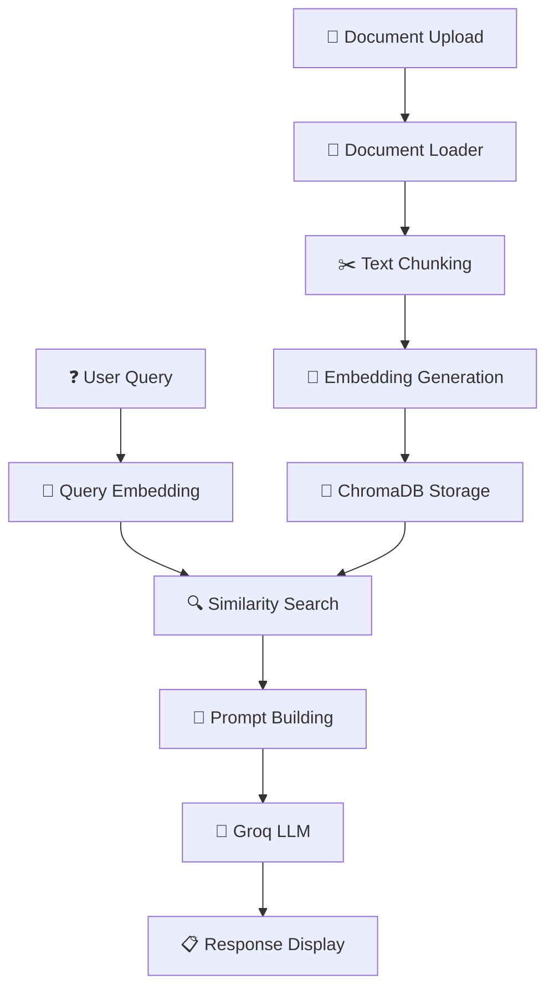

# 🤖 RAGLite - CPU-Optimized Retrieval-Augmented Generation Pipeline

[](https://www.python.org/downloads/)
[](https://opensource.org/licenses/MIT)
[](https://streamlit.io/)

A comprehensive, CPU-optimized Retrieval-Augmented Generation (RAG) system that intelligently answers questions based on your documents using state-of-the-art AI models.

## ✨ Features

- **🧠 CPU-Optimized**: Runs entirely on CPU with optimized performance
- **📄 Multi-Format Support**: PDF, DOCX, and TXT document processing
- **🔍 Smart Retrieval**: Cosine similarity search with ChromaDB
- **🚀 Fast Embeddings**: sentence-transformers/all-MiniLM-L6-v2 model
- **🤖 Advanced LLM**: Groq's meta-llama/llama-4-maverick-17b-128k-instruct
- **🎨 Beautiful UI**: Intuitive Streamlit web interface
- **📊 Performance Benchmarking**: Comprehensive testing and analytics
- **🔧 Modular Architecture**: Easy to extend and customize

## 🏗️ Architecture



## 🚀 Quick Start

### Prerequisites

- Python 3.11 or higher
- Groq API key ([Get one here](https://console.groq.com/))

### One-Click Setup

```bash
# Clone or download the project
cd RAGLite

# Run the setup script
./setup.sh
```

The setup script will:
- ✅ Create a virtual environment
- ✅ Install all dependencies  
- ✅ Download the embedding model
- ✅ Create necessary directories
- ✅ Generate configuration files

### Manual Setup

If you prefer manual installation:

```bash
# Create virtual environment
python3 -m venv venv
source venv/bin/activate  # On Windows: venv\Scripts\activate

# Install dependencies
pip install -r raglite/requirements.txt

# Create directories
mkdir -p data/chroma_db data/uploads benchmarks logs

# Copy environment file
cp .env.example .env
# Edit .env and add your Groq API key
```

## 🎯 Usage

### 1. Start the Application

```bash
# Using the launch script
./launch_raglite.sh

# Or manually
source venv/bin/activate
streamlit run raglite/api/app.py
```

### 2. Configure API Key

1. Open the web interface at `http://localhost:8501`
2. Enter your Groq API key in the sidebar
3. Adjust model settings as needed

### 3. Upload Documents

1. Go to the "📁 Upload Documents" tab
2. Select your PDF, DOCX, or TXT files
3. Click "🚀 Process Documents"
4. Wait for processing to complete

### 4. Ask Questions

1. Switch to the "💬 Chat" tab
2. Type your question about the documents
3. Get intelligent, context-aware answers
4. View source citations and relevance scores

## 📚 Project Structure

```
RAGLite/
├── raglite/                     # Main package
│   ├── loaders/                 # Document loading & chunking
│   │   ├── __init__.py
│   │   └── loader.py
│   ├── embeddings/              # Embedding generation
│   │   ├── __init__.py
│   │   └── embedder.py
│   ├── vectorstore/             # ChromaDB integration
│   │   ├── __init__.py
│   │   └── chroma_manager.py
│   ├── retrieval/               # Document retrieval
│   │   ├── __init__.py
│   │   └── retriever.py
│   ├── llm/                     # LLM integration
│   │   ├── __init__.py
│   │   └── groq_client.py
│   ├── utils/                   # Utilities
│   │   ├── __init__.py
│   │   └── prompt.py
│   ├── api/                     # Web interface
│   │   └── app.py
│   ├── benchmarks/              # Performance testing
│   │   ├── __init__.py
│   │   └── benchmark.py
│   ├── __init__.py
│   └── requirements.txt
├── data/                        # Data storage
│   ├── chroma_db/              # Vector database
│   └── uploads/                # Uploaded files
├── benchmarks/                  # Benchmark results
├── logs/                        # Application logs
├── setup.sh                    # Setup script
├── launch_raglite.sh           # Launch script
├── test_raglite.py             # Test script
├── .env                        # Environment config
└── README.md
```

## ⚙️ Configuration

### Environment Variables

Edit the `.env` file to customize settings:

```bash
# Groq API Configuration
GROQ_API_KEY=your_groq_api_key_here

# Model Configuration
EMBEDDING_MODEL=sentence-transformers/all-MiniLM-L6-v2
LLM_MODEL=meta-llama/llama-4-maverick-17b-128k-instruct
TEMPERATURE=0.2
MAX_TOKENS=1024

# Document Processing
CHUNK_SIZE=500
CHUNK_OVERLAP=50

# Storage
CHROMA_DB_PERSIST_DIRECTORY=./data/chroma_db
```

### Model Settings

- **Temperature**: Controls response creativity (0.0-1.0)
- **Max Tokens**: Maximum response length
- **Top-K**: Number of documents to retrieve
- **Chunk Size**: Document chunk size for processing

## 🔧 Advanced Features

### Custom Prompt Templates

Create custom prompts for different use cases:

```python
from raglite import PromptBuilder

prompt_builder = PromptBuilder()
prompt_builder.add_custom_template(
    "research", 
    "Based on the research papers: {context}\n\nQuestion: {question}\n\nProvide a scholarly analysis:"
)
```

### Performance Benchmarking

Run comprehensive performance tests:

```python
from raglite.benchmarks import RAGBenchmark

benchmark = RAGBenchmark(retriever, groq_client)
results = benchmark.run_comprehensive_benchmark(
    document_paths=["test_doc.pdf"],
    test_queries=["What is this document about?"]
)
```

### Programmatic Usage

Use RAGLite programmatically:

```python
from raglite import DocumentLoader, Retriever, GroqClient

# Load documents
loader = DocumentLoader()
documents = loader.load_document("my_document.pdf")

# Initialize retriever
retriever = Retriever()
retriever.add_documents(documents)

# Query with LLM
groq_client = GroqClient(api_key="your_key")
retrieved_docs = retriever.retrieve_similar("What is this about?")
response = groq_client.generate_rag_response("What is this about?", retrieved_docs)

print(response['response'])
```

## 📊 Performance

### Typical Performance Metrics

- **Document Loading**: ~2-5 seconds per PDF
- **Embedding Generation**: ~100-500 texts/second
- **Retrieval Time**: ~50-200ms per query
- **End-to-End Response**: ~2-5 seconds
- **Memory Usage**: ~200-500MB (depending on document size)

### Optimization Tips

1. **Batch Processing**: Upload multiple documents at once
2. **Chunk Size**: Adjust based on document type and query complexity
3. **Top-K**: Use 3-7 for most queries
4. **Embedding Cache**: Models are cached after first load

## 🧪 Testing

Run the test suite to verify installation:

```bash
./test_raglite.py
```

This will test:
- ✅ Module imports
- ✅ Embedding model loading
- ✅ Document processing
- ✅ ChromaDB connectivity

## 🐛 Troubleshooting

### Common Issues

**1. Import Errors**
```bash
# Ensure virtual environment is activated
source venv/bin/activate
pip install -r raglite/requirements.txt
```

**2. Groq API Errors**
- Verify API key in `.env` file
- Check internet connection
- Verify API key validity at console.groq.com

**3. ChromaDB Issues**
```bash
# Reset the database
rm -rf data/chroma_db
# Restart the application
```

**4. Memory Issues**
- Reduce batch size for embeddings
- Process fewer documents at once
- Increase system memory or use swap

**5. Performance Issues**
- Reduce chunk size for faster processing
- Lower top-k for faster retrieval
- Use SSD storage for ChromaDB

## 🛠️ Development

### Contributing

1. Fork the repository
2. Create a feature branch
3. Make your changes
4. Add tests if applicable
5. Submit a pull request

### Code Style

- Follow PEP 8
- Use type hints
- Add docstrings to functions
- Write descriptive commit messages

### Running Tests

```bash
# Install development dependencies
pip install pytest pytest-cov black flake8

# Run tests
pytest

# Check code style
black raglite/
flake8 raglite/
```

## 📄 License

This project is licensed under the MIT License - see the [LICENSE](LICENSE) file for details.

## 🙏 Acknowledgments

- **[Sentence Transformers](https://www.sbert.net/)** for embeddings
- **[ChromaDB](https://www.trychroma.com/)** for vector storage
- **[Groq](https://groq.com/)** for fast LLM inference
- **[Streamlit](https://streamlit.io/)** for the web interface
- **[LangChain](https://langchain.com/)** for document processing

## 🚀 What's Next?

- [ ] Support for more document formats (HTML, Markdown)
- [ ] Integration with more LLM providers
- [ ] Advanced search filters and metadata
- [ ] Conversation history and context
- [ ] API endpoint for programmatic access
- [ ] Docker containerization
- [ ] Cloud deployment guides

## 💬 Support

- **Documentation**: Check this README and code comments
- **Issues**: Open an issue on GitHub
- **Discussions**: Use GitHub Discussions for questions

---

**Made with ❤️ by the RAGLite Team**

*Bringing intelligent document understanding to everyone, one query at a time.* 